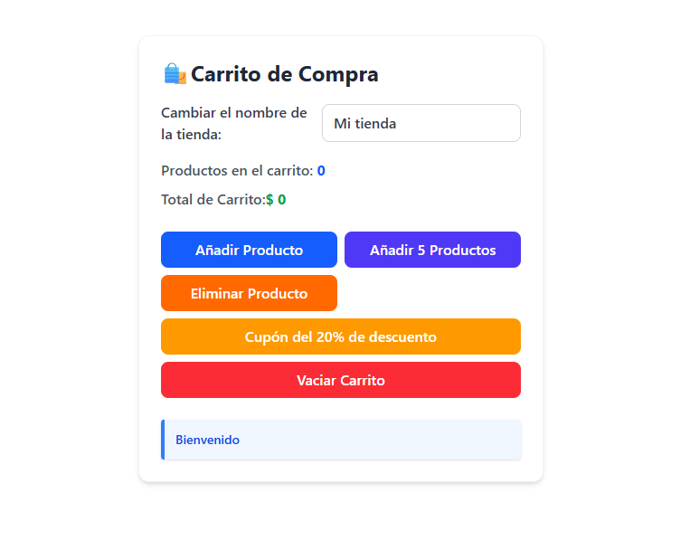

# Carrito Web Sencillo

[](https://angular.dev) [](https://www.typescriptlang.org/) [](https://tailwindcss.com/) [](LICENSE)


Aplicación web sencilla desarrollada con Angular y Tailwind CSS como práctica de conceptos básicos del framework.

## Descripción

Este proyecto simula un carrito de compra básico en el que es posible:

- Cambiar el nombre de la tienda.
- Añadir productos al carrito.
- Añadir cinco productos de una sola vez.
- Eliminar productos.
- Aplicar un descuento del 20%.
- Vaciar el carrito.
- Mostrar notificaciones según las acciones realizadas.
- Controlar un límite máximo de precio.

## Vista previa



## Tecnologías utilizadas

## 🛠️ Tecnologías utilizadas

| Tecnología   | Versión |
| ------------ | ------- |
| Angular      | 22      |
| TypeScript   | 6.x     |
| Tailwind CSS | 4.x     |
| HTML5        | —       |
| CSS3         | —       |

## Requisitos

Antes de ejecutar el proyecto necesitas tener instalado:

* **Node.js**
* **npm**
* **Angular CLI**

Puedes comprobar las versiones instaladas con:

```bash
node --version
npm --version
ng version
```

## Conceptos practicados

### Interpolación

```html
{{ totalCarrito }}
```

### Event Binding

```html
(click)="addProducto()"
```

### Two-Way Data Binding

```html
<input [(ngModel)]="nombreTienda">
```

### Renderizado condicional

```html
@if(notificacion){
  ...
}
```

### Componentes y métodos

```ts
addProducto()
deleteProducto()
vaciarCarrito()
```

## Instalación

```bash
git clone https://github.com/TU-USUARIO/carrito-angular.git
cd carrito-angular
npm install
ng serve
```

Abrir en:

```text
http://localhost:4200
```

## Autor

Mateo López

